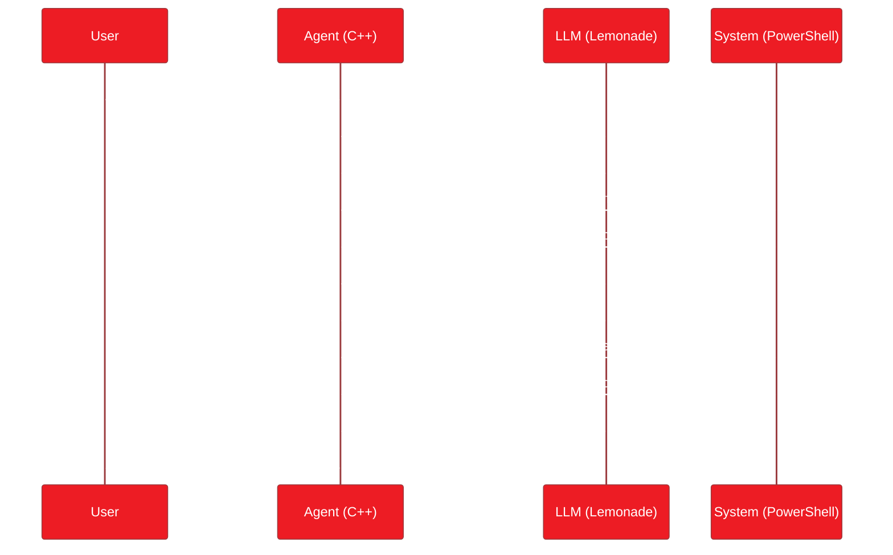
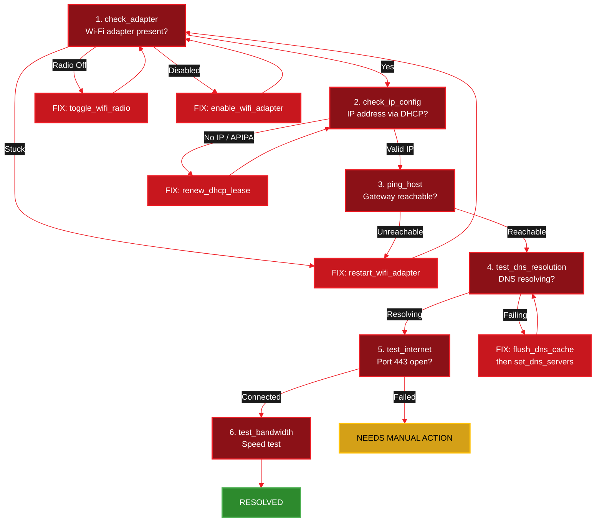

<Info>
  **Source Code:** [`cpp/examples/wifi_agent.cpp`](https://github.com/amd/gaia/blob/main/cpp/examples/wifi_agent.cpp) — single-file, self-contained agent (~790 lines including 13 tools and a custom TUI).
</Info>

<Note>
**Platform:** Windows (PowerShell network commands). Compiles on Linux for CI but tools require Windows to return real data.
**Prerequisite:** [Lemonade Server](https://lemonade-server.ai) running with a model loaded.
</Note>

---

## What This Agent Does

The Wi-Fi Troubleshooter is an AI agent that acts like an IT support specialist. When a user says *"my internet isn't working"*, it runs a systematic diagnostic chain, reads real output from your machine, reasons about what's wrong, and applies fixes automatically.

- **Runs real commands** — every tool executes an actual PowerShell command and returns real output
- **LLM-driven reasoning** — no hardcoded if/else tree; the LLM reads each result and decides the next step
- **Pure C++** — no Python, no MCP subprocess, no external dependencies. Just a compiled binary talking to a local LLM
- **Fully local** — the LLM runs on your AMD hardware via [Lemonade Server](https://lemonade-server.ai). No data leaves your machine

---

## Demo

<video
  controls
  autoPlay
  loop
  muted
  playsInline
  className="w-full rounded-lg"
  src="https://assets.amd-gaia.ai/videos/wifi-agent-cpp-npu.webm"
/>

Full diagnostic run on a Ryzen AI PC: the agent calls 5 tools in sequence, reads real network output, and reports status — all powered by a local LLM on the NPU.

---

## Quick Start

<Steps>
  <Step title="Build">
    <Tabs>
      <Tab title="Windows (MSVC)">
        ```bat
        cd cpp
        ```
        ```bat
        cmake -B build -G "Visual Studio 17 2022" -A x64
        ```
        ```bat
        cmake --build build --config Release
        ```
        Binary: `cpp\build\Release\wifi_agent.exe`
      </Tab>
      <Tab title="Windows (Ninja)">
        ```bat
        cd cpp
        ```
        ```bat
        cmake -B build -G Ninja -DCMAKE_BUILD_TYPE=Release
        ```
        ```bat
        cmake --build build
        ```
      </Tab>
      <Tab title="Linux">
        ```bash
        cd cpp
        ```
        ```bash
        cmake -B build -DCMAKE_BUILD_TYPE=Release
        ```
        ```bash
        cmake --build build
        ```
        <Note>
        Compiles on Linux for CI purposes, but the PowerShell-based tools require Windows to return meaningful results.
        </Note>
      </Tab>
    </Tabs>
  </Step>

  <Step title="Start Lemonade Server">
    ```bash
    lemonade-server serve
    ```
    The agent connects to `http://localhost:8000/api/v1` by default.
  </Step>

  <Step title="Run the agent (run as admin for fix tools)">
    ```bat
    cpp\build\Release\wifi_agent.exe
    ```

    Try these prompts:
    ```
    You: Run a full network diagnostic.
    You: My Wi-Fi is connected but I can't browse the web.
    You: Check if DNS is working and fix it if not.
    ```
  </Step>
</Steps>

---

## Architecture

The agent loop is a conversation between your C++ code and the LLM:



**Your C++ code provides the tools** (what the agent *can* do), **the system prompt provides the strategy** (what it *should* do), and **the LLM connects the two.**

---

## How It Works

The agent subclasses `gaia::Agent` with three pieces: a config, registered tools, and a system prompt.

```cpp
class WiFiTroubleshooterAgent : public gaia::Agent {
public:
    explicit WiFiTroubleshooterAgent(const std::string& modelId)
        : Agent(makeConfig(modelId)) {
        setOutputHandler(std::make_unique<CleanConsole>());  // custom TUI
        init();  // calls registerTools() + composes system prompt
    }

protected:
    std::string getSystemPrompt() const override {
        return R"(You are an expert Windows network troubleshooter...
            // Diagnostic sequence, fix instructions, output format
        )";
    }

    void registerTools() override {
        // 13 tools: 7 diagnostic + 6 fix (see tables below)
        toolRegistry().registerTool("check_adapter", ...);
        toolRegistry().registerTool("ping_host", ...);
        // ...
    }

private:
    static gaia::AgentConfig makeConfig(const std::string& modelId) {
        gaia::AgentConfig config;
        config.maxSteps = 20;   // up to 20 tool calls per query
        config.modelId = modelId;
        return config;
    }
};
```

Each tool is a C++ lambda that runs a PowerShell command and returns the output:

```cpp
toolRegistry().registerTool(
    "check_adapter",                          // name the LLM calls
    "Show Wi-Fi adapter status including "    // description the LLM reads
    "SSID, signal strength, and state.",
    [](const gaia::json& /*args*/) -> gaia::json {
        std::string output = runShell("netsh wlan show interfaces");
        return {{"tool", "check_adapter"}, {"output", output}};
    },
    {}  // no parameters
);
```

Tools with parameters validate input before passing to the shell:

```cpp
toolRegistry().registerTool(
    "ping_host",
    "Ping a specific host and return connection status.",
    [](const gaia::json& args) -> gaia::json {
        std::string host = args.value("host", "");
        if (host.empty()) return {{"error", "host parameter is required"}};
        if (!isSafeShellArg(host)) return {{"error", "Invalid host"}};
        std::string output = runShell("Test-NetConnection -ComputerName " + host + " | ConvertTo-Json");
        return {{"tool", "ping_host"}, {"output", output}};
    },
    {{"host", gaia::ToolParamType::STRING, true, "Hostname or IP to ping"}}
);
```

<Note>
All string arguments from the LLM are validated with `isSafeShellArg()` to reject shell metacharacters before constructing commands. See the [Custom Agent guide](/cpp/custom-agent) for details on tool registration patterns.
</Note>

---

## Tool Reference

### Diagnostic Tools (Read-Only)

| Tool | What It Runs | Parameters |
|------|-------------|------------|
| `check_adapter` | `netsh wlan show interfaces` | none |
| `check_wifi_drivers` | `netsh wlan show drivers` | none |
| `check_ip_config` | `ipconfig /all` | none |
| `test_dns_resolution` | `Resolve-DnsName` | `hostname` (optional) |
| `test_internet` | `Test-NetConnection 8.8.8.8 -Port 443` | none |
| `test_bandwidth` | Cloudflare CDN parallel download/upload | none |
| `ping_host` | `Test-NetConnection <host>` | `host` (required) |

### Fix Tools (Write Operations)

| Tool | What It Runs | When to Use |
|------|-------------|-------------|
| `flush_dns_cache` | `Clear-DnsClientCache` | Stale DNS entries |
| `set_dns_servers` | `Set-DnsClientServerAddress` | Default DNS not responding |
| `renew_dhcp_lease` | `ipconfig /release` + `/renew` | No IP or APIPA address |
| `toggle_wifi_radio` | Windows Radio Management API | Adapter shows "Software Off" |
| `enable_wifi_adapter` | `Enable-NetAdapter` | Adapter administratively disabled |
| `restart_wifi_adapter` | `Disable-NetAdapter` + `Enable-NetAdapter` | Adapter stuck in bad state |

---

## Diagnostic Flow

The system prompt teaches the LLM this decision tree. Each fix loops back to re-verify before declaring success:



---

## Extending the Agent

Add a tool inside `registerTools()` and update the system prompt:

```cpp
toolRegistry().registerTool(
    "check_firewall",
    "Check if Windows Firewall is blocking outbound connections.",
    [](const gaia::json& /*args*/) -> gaia::json {
        std::string output = runShell(
            "Get-NetFirewallProfile | Select-Object Name, Enabled | ConvertTo-Json"
        );
        return {{"tool", "check_firewall"}, {"output", output}};
    },
    {}
);
```

The framework handles everything else — the new tool appears in the LLM's system prompt automatically.

---

## Next Steps

<CardGroup cols={2}>
  <Card title="System Health Agent" icon="desktop" href="/cpp/health-agent">
    Compare with the MCP-based approach for system diagnostics
  </Card>

  <Card title="C++ Framework Overview" icon="code" href="/cpp/overview">
    AgentConfig reference, project structure, and how the agent loop works
  </Card>

  <Card title="Integration Guide" icon="puzzle-piece" href="/cpp/integration">
    Use gaia_core in your own CMake project via FetchContent or find_package
  </Card>

  <Card title="Customizing Your Agent" icon="sliders" href="/cpp/custom-agent">
    Custom prompts, typed tools, MCP servers, output capture, and tuning
  </Card>
</CardGroup>

---

<small style="color: #666;">

**License**

Copyright(C) 2025-2026 Advanced Micro Devices, Inc. All rights reserved.

SPDX-License-Identifier: MIT

</small>
