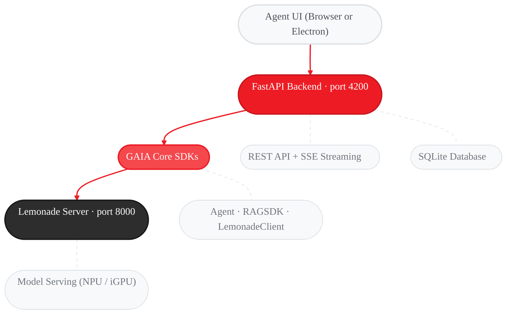

GAIA Agent UI is a desktop interface for running AI agents **100% locally** on your AMD hardware. Use agents to analyze documents, generate code, answer questions, and accomplish tasks on your PC — all without sending data to the cloud.

<Info>
  This guide assumes you have completed the [Quickstart](/quickstart) and have GAIA installed.
</Info>

<Warning>
  **Tested Configuration:** The Agent UI has been tested exclusively on **AMD Ryzen AI MAX+ 395** processors running the **Qwen3.5-35B-A3B-GGUF** model via Lemonade Server. Other hardware or model combinations may work but are not officially verified.

  If you encounter issues on a different configuration, please [open a GitHub issue](https://github.com/amd/gaia/issues/new) and include:
  - Your processor model (e.g., Ryzen AI 9 HX 370, Ryzen AI MAX+ 395)
  - RAM and available memory
  - The LLM model you are using
  - Operating system and version
  - Steps to reproduce the issue
</Warning>

---

## Getting Started

### Prerequisites

The Agent UI requires two backend services:

1. **Lemonade Server** — serves the LLM locally (port 8000)
2. **A downloaded model** — the LLM the agent uses to reason

<Note>
  **Using the desktop installer or npm install?** Both paths download Lemonade
  Server and the default model on first launch, so you can skip the manual
  `gaia init` step and jump straight to [Install and Launch](#install-and-launch).
  Prebuilt `.exe` / `.deb` desktop installers live on the
  [GitHub Releases page](https://github.com/amd/gaia/releases).
</Note>

If you're using the Python CLI path, or want the full-size model, run:

```bash
gaia init --profile chat
```

This downloads Lemonade Server and the recommended model (~25 GB). Use `--profile minimal` for a smaller download (~400 MB).

Then start the server:

```bash
lemonade-server serve
```

### Install and Launch

Pick the install path that fits you best:

<Tabs>
  <Tab title="Desktop installer (easiest)">
    Prebuilt desktop installers are published on the
    [GitHub Releases page](https://github.com/amd/gaia/releases) alongside
    each tagged release. They bundle the Electron shell; Lemonade Server and
    the default model are downloaded automatically on first launch. This is
    the simplest path for non-developer end users.

    **Artifact naming** (`electron-builder.yml`):
    `gaia-agent-ui-<version>-<arch>-setup.<ext>` — e.g. `gaia-agent-ui-0.17.2-x64-setup.exe`
    and `gaia-agent-ui-0.17.2-amd64.deb`.

    **Windows (.exe):**
    1. Download `gaia-agent-ui-<version>-x64-setup.exe` from [Releases](https://github.com/amd/gaia/releases).
    2. Double-click to install, then launch "GAIA" from the Start Menu (binary: `gaia-desktop`).
    3. Update by downloading and running the newer installer.
    4. Uninstall via Windows Settings → Apps → Installed apps → GAIA.

    **Ubuntu (.deb):**
    ```bash
    sudo apt install ./gaia-agent-ui-<version>-amd64.deb
    gaia-desktop
    # Update: apt install the newer .deb the same way.
    # Uninstall (apt package name is `gaia-desktop`):
    sudo apt remove gaia-desktop
    ```

    See the [Packaging & Distribution](/deployment/ui) page for more detail on
    the installers, supported platforms, and signing.
  </Tab>

  <Tab title="npm">
    The npm package bundles everything — on first run it auto-installs the Python backend (uv, Python 3.12, amd-gaia), Lemonade Server, and a minimal model.

    **Requires:** [Node.js 20+](https://nodejs.org) (`winget install OpenJS.NodeJS.LTS` on Windows, `brew install node@20` on macOS)

    ```bash
    npm install -g @amd-gaia/agent-ui
    ```

    Then launch:

    ```bash
    gaia-ui
    ```

    The Agent UI opens automatically in your browser at [http://localhost:4200](http://localhost:4200).

    **Options:**

    | Flag | Description |
    |------|-------------|
    | `gaia-ui --port 8080` | Custom port |
    | `gaia-ui --no-open` | Don't auto-open the browser |
    | `gaia-ui --serve` | Serve frontend only (Node.js static server) |
    | `gaia-ui --version` | Show version |

    **Update:**

    ```bash
    npm install -g @amd-gaia/agent-ui@latest
    ```
  </Tab>

  <Tab title="Python CLI">
    If you already have GAIA installed via pip/uv, launch the Agent UI directly:

    ```bash
    gaia chat --ui
    ```

    Or equivalently:

    ```bash
    gaia --ui
    ```

    The Agent UI starts on [http://localhost:4200](http://localhost:4200). Open this URL in your browser.

    <Note>
      **Source/dev installs:** The frontend is built during `gaia init`. If you see a JSON response instead of the UI, run `gaia init` or manually build (from the repo root):

      ```bash
      cd src/gaia/apps/webui && npm install && npm run build
      ```
    </Note>

    **Options:**

    | Flag | Description |
    |------|-------------|
    | `gaia chat --ui --ui-port 8080` | Custom port |
    | `gaia --ui --ui-port 8080` | Custom port (top-level alias) |
    | `gaia --ui --base-url http://192.168.1.100:8000/api/v1` | Connect to Lemonade on another machine (e.g., GPU workstation) |

    <Note>
      If you see a missing dependencies error, install the UI extras:

      ```bash
      uv pip install "amd-gaia[ui]"
      ```
    </Note>
  </Tab>
</Tabs>

---

## What You Can Do

### Search and Browse Files

The agent has access to your local file system. Ask it to find files, explore directories, or locate specific content across your projects — no manual browsing required.

### Analyze Documents

Once the agent finds files — or you drag them into a session — it can index and analyze their content. Ask it to summarize, compare, extract data, or answer questions about any supported format:

- **Documents:** PDF, Word, PowerPoint, Excel, TXT, Markdown, CSV, JSON, HTML, XML, YAML
- **Code:** Python, JavaScript, TypeScript, Java, C/C++, Go, Rust, Ruby, Shell
- **Config:** INI, CFG, TOML, YAML, JSON, XML

### Session Management

Create, rename, search, export (Markdown/JSON), and delete sessions. Sessions persist across the CLI (`gaia chat`) and the Agent UI.

---

## Keyboard Shortcuts

| Shortcut | Action |
|----------|--------|
| `Enter` | Send task / message |
| `Shift+Enter` | New line |
| `Escape` | Stop agent response |
| `Ctrl+K` | Focus sidebar search |

---

## MCP Server

The Agent UI includes a built-in **MCP (Model Context Protocol) server** that exposes the full Agent UI as a set of tools. This lets external AI assistants — like **Claude Code**, **Cursor**, or any MCP-compatible client — interact with GAIA agents through the same backend that powers the web UI.

Conversations initiated via MCP appear in the browser UI in real time, so you can watch tool execution and agent activity as it happens.

The MCP server provides 15 tools for managing sessions, sending messages, indexing documents, browsing files, and more.

See the [Agent UI MCP Server guide](/guides/mcp/agent-ui) for setup instructions and usage examples.

---

## Troubleshooting

<AccordionGroup>
  <Accordion title="Lemonade Server not running">
    Start Lemonade with `lemonade-server serve`. If Lemonade is not installed, follow the initialization steps in the [Quickstart](/quickstart#cli-install).
  </Accordion>

  <Accordion title="No model loaded">
    Download models with `gaia init --profile chat`. See the [Quickstart](/quickstart#cli-install) for details.
  </Accordion>

  <Accordion title="Port 4200 already in use">
    ```bash
    # npm CLI
    gaia-ui --port 8080

    # Python CLI
    gaia --ui-port 8080
    ```
  </Accordion>

  <Accordion title="Database locked error">
    Close any other GAIA Agent UI or CLI instances. Only one writer at a time is supported.
  </Accordion>

  <Accordion title="Document indexing fails">
    - Ensure the file is a supported format and not password-protected
    - Keep file size under 100MB
    - For PDF image extraction, download the VLM model: `gaia download --agent chat`
  </Accordion>

  <Accordion title="Frontend shows JSON instead of the UI">
    The Agent UI frontend has not been built.

    **npm install (`gaia-ui`):** This is handled automatically — `gaia-ui` tells the Python server where to find the pre-built frontend. If you still see this error, try reinstalling: `npm install -g @amd-gaia/agent-ui@latest` Then restart with `gaia-ui`.

    **Source/dev installs (git clone):** Run `gaia init` to build it automatically, or manually (from the repo root):

    ```bash
    cd src/gaia/apps/webui && npm install && npm run build
    ```

    Then restart `gaia chat --ui`.

    **pip/PyPI installs (without gaia-ui):** Use the [npm install path](#install-and-launch) — the pip package does not include frontend source files.
  </Accordion>
</AccordionGroup>

---

## Architecture



For the REST API reference and backend classes, see the [Agent UI SDK Reference](/sdk/sdks/agent-ui).

---

## Next Steps

<CardGroup cols={2}>
  <Card title="Agent UI SDK Reference" icon="code" href="/sdk/sdks/agent-ui">
    REST endpoints, database schema, and Python backend API
  </Card>

  <Card title="Document Q&A Agent" icon="file-lines" href="/guides/chat">
    CLI-based document agent with RAG, debug mode, and chunking strategies
  </Card>

  <Card title="Build Your First Agent" icon="rocket" href="/quickstart#build-your-first-agent">
    Create a custom agent with tools in minutes
  </Card>

  <Card title="MCP Server" icon="plug" href="/guides/mcp/agent-ui">
    Connect Claude Code, Cursor, or any MCP client to the Agent UI
  </Card>
</CardGroup>

---

<small style="color: #666;">

**License**

Copyright(C) 2024-2026 Advanced Micro Devices, Inc. All rights reserved.

SPDX-License-Identifier: MIT

</small>
